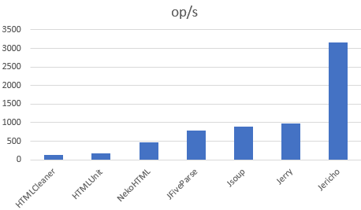

html-parser-benchmark
================

HTML parsers benchmark

* HTMLCleaner
* HTMLUnit
* NekoHTML
* JFiveParse
* JSoup
* Jerry

Running the benchmark
======================

1. Download the source code and build it (`mvn clean install`)
2. Run the entire benchmark suite with `java -jar target/html-parser-bench.jar`
3. (Optional) To save resutls to csv use  `java -jar target/html-parser-bench.jar -rff results.csv -rf csv`

(This benchmark is based on https://github.com/mbosecke/template-benchmark but changed to benchmark HTML parsers instead of templating engines)


Interpreting the Results
========================
The benchmarks measure throughput, given in "ops/time". The time unit used is seconds.
The tests benchmark how fast a small html fragment (h2 element with id "mp-dyk-h2") is extracted from the wikipedia.html (wikipedia's main page) file. 
The score represents the number of times this operation is done per second; the higher the score, the better.

Example Results
===============

```
Benchmark                    Mode  Cnt    Score   Error  Units
HTMLCleanerBench.benchmark  thrpt       127,031          ops/s
HtmlUnitBench.benchmark     thrpt       177,482          ops/s
JFiveParseBench.benchmark   thrpt       656,367          ops/s
JerryBench.benchmark        thrpt       994,163          ops/s
JsoupBench.benchmark        thrpt       904,480          ops/s
NekoHTMLBench.benchmark     thrpt       476,903          ops/s
```


